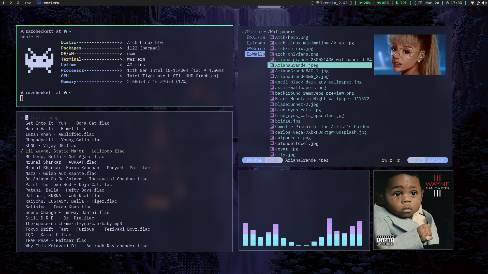

# DWM (Dynamic Window Manager)



# User Guide:

- Application rules are defined in a separate file called `apprules.h`.

## Build Instrcutions:

### compile dependencies:

- Arch Linux:

  ```bash
  sudo pacman -S --needed base-devel xorg-server xorg-xinit libx11 libxinerama libxft imlib2 git && \
  	git clone https://github.com/razobeckett/dwm && \
  	cd dwm && sudo make clean install
  ```

- Ubuntu/Debian:

  ```bash
  sudo apt install -y build-essential xorg libx11-dev libxinerama-dev libxft-dev libimblib2-dev git && \
    git clone https://github.com/razobeckett/dwm && \
    cd dwm && sudo make clean install
  ```

### How to compile:

- Clone the repository and change directory:

  ```bash
  git clone https://github.com/razobeckett/dwm && cd dwm
  ```

  - Compile and install:

  ```bash
  make clean install
  ```

> [!IMPORTANT]
> If you are not a root user, you can use `doas` or `sudo` to run the command.

- After compiling, you can start the window manager using the following methods:
  - for Xinit:
    - put `exec dwm` in `~/.xinitrc` at the end on new line
    - now run `startx`
  - for display manager:
    - paste [dwm.desktop](dwm.desktop) file in `/usr/share/xsessions/`
    - restart your display manager or system

### Keybinds

> [!NOTE]
> These are just a few basic keybinds to get started; you can always add and modify them in `config.def.h`.


| Keybind                                                          | Function                                  |
| ---------------------------------------------------------------- | ----------------------------------------- |
| <kbd>SUPER</kbd> + <kbd>RETURN</kbd>                             | Opens the terminal.                       |
| <kbd>SUPER</kbd> + <kbd>SPACE</kbd>                              | Opens dmenu.                              |
| <kbd>ALT</kbd> + [<kbd>1</kbd>..<kbd>0</kbd>]                    | Switches between tags (workspaces).       |
| <kbd>ALT</kbd> + <kbd>SHIFT</kbd> + [<kbd>1</kbd>..<kbd>0</kbd>] | Moves window between tags (workspaces).   |
| <kbd>ALT</kbd> + <kbd>SHIFT</kbd> + <kbd>L</kbd>/<kbd>H</kbd>    | Moves window right and left respectively. |
| <kbd>ALT</kbd> + <kbd>Q</kbd>                                    | Closes the window.                        |

### Addition Utilities used with setup:

- [**picom**](https://github.com/yshui/picom): Enables effects and animations.
- [**dwmblocks-async**](https://github.com/UtkarshVerma/dwmblocks-async): Displays system status and date/time.

> [!CAUTION]
> This Build of DWM been heavily modified; if you wish to apply any patches, it is recommended to do so manually.

## About DWM

[DWM](https://dwm.suckless.org/) is a dynamic window manager for X. It manages windows in tiled, monocle, and floating layouts. All of the layouts can be applied dynamically, optimizing the environment for the application in use and the task performed.
